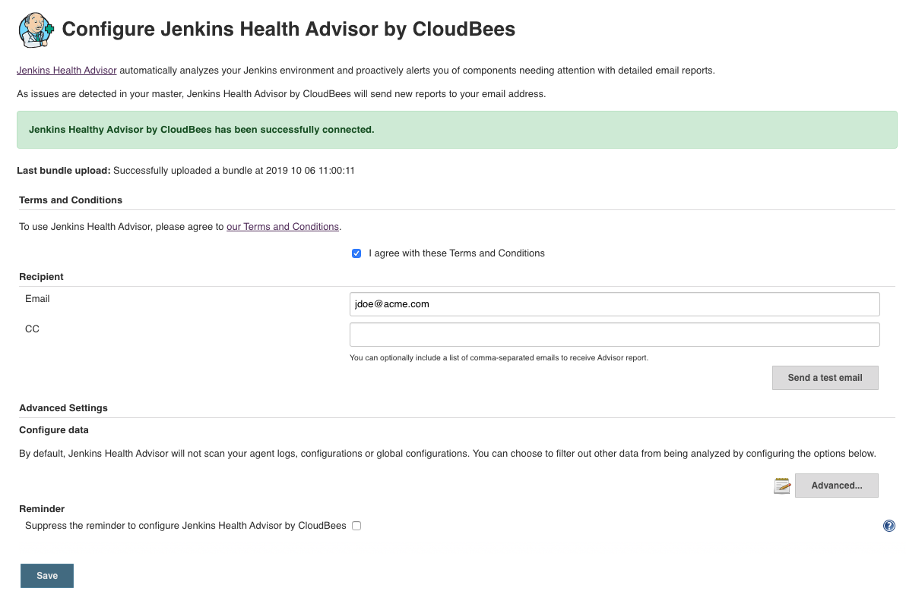
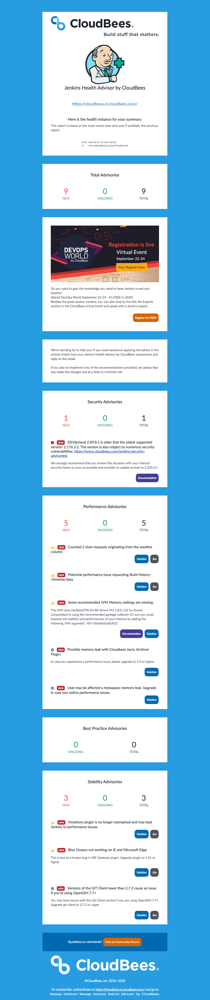

# Jenkins Health Advisor by CloudBees

[](https://ci.jenkins.io/job/Plugins/job/cloudbees-jenkins-advisor-plugin/job/master/)
[](https://github.com/jenkinsci/cloudbees-jenkins-advisor-plugin/graphs/contributors)
[](https://plugins.jenkins.io/cloudbees-jenkins-advisor)
[](https://github.com/jenkinsci/cloudbees-jenkins-advisor-plugin/releases/latest)
[](https://plugins.jenkins.io/cloudbees-jenkins-advisor)
[](https://www.cloudbees.com/products/cloudbees-jenkins-support?utm_medium=badge&utm_source=github&utm_campaign=cloudbees-jenkins-advisor-plugin)


## Introduction

Jenkins Health Advisor by CloudBees (formerly known as "CloudBees Jenkins Advisor") proactively notifies you of problems with your Jenkins-based environment. Jenkins Health Advisor by CloudBees identifies numerous issues before they affect your users, including security vulnerabilities, performance problems, and plugin version issues. Best of all, Jenkins Health Advisor by CloudBees is constantly being improved by the [CloudBees Support](https://www.cloudbees.com/products/cloudbees-jenkins-support?utm_medium=documentation&utm_source=github&utm_campaign=cloudbees-jenkins-advisor-plugin) and Engineering teams to cover the most recent identified issues.

By default, you’ll receive a summary email whenever a new problem is identified in your Jenkins instance. You can configure the email address Jenkins Health Advisor by CloudBees uses in the Configuration section.

Initially, Jenkins Health Advisor by CloudBees sends an initial report that lists everything it detects in your system. Subsequent reports will only report changes from the initial report. It’s important to note that Jenkins Health Advisor by CloudBees only emails you if it finds something wrong: if it doesn’t find any problem in your system, it won’t send you email.

Jenkins Health Advisor by CloudBees identifies problems by scanning a Support Bundle generate by the [support-core](https://plugins.jenkins.io/support-core) plugin from your Jenkins master. The Support Bundle is generated on a daily basis by the plugin and submitted to servers hosted by CloudBees. For instructions on defining the types and kinds of data to include in the Support Bundle, see the Optional Configuration section in the [documentation...](https://docs.cloudbees.com/docs/admin-resources/latest/plugins/cloudbees-jenkins-advisor?utm_medium=documentation&utm_source=github&utm_campaign=cloudbees-jenkins-advisor-plugin)

### Configuration panel



### Configuration as Code Support

The version 3.0 of Jenkins Health Advisor by CloudBees is adding the support for [Jenkins Configuration as Code](https://jenkins.io/projects/jcasc/).
Here is a configuration sample:

```yaml
advisor:
  acceptToS: true
  email: "jdoe@acme.com"
  ccs:
    - "list1@acme.com"
    - "list2@acme.com"
  excludedComponents:
    - "ItemsContent"
    - "GCLogs"
    - "Agents"
    - "AgentsConfigFile"
    - "ConfigFileComponent"
    - "RootCAs"
    - "SlaveLogs"
    - "OtherConfigFilesComponent"
    - "HeapUsageHistogram"
  nagDisabled: false
``` 

### Report sample

Once configured you are receiving an email like this one each time a new issue is detected on your instance.



## Documentation

See [https://docs.cloudbees.com/docs/admin-resources/latest/plugins/cloudbees-jenkins-advisor](https://docs.cloudbees.com/docs/admin-resources/latest/plugins/cloudbees-jenkins-advisor?utm_medium=documentation&utm_source=github&utm_campaign=cloudbees-jenkins-advisor-plugin)

## Troubleshooting
See [Jenkins Health Advisor by CloudBees - Troubleshooting Guide](https://support.cloudbees.com/hc/en-us/articles/115001213031?utm_medium=documentation&utm_source=github&utm_campaign=cloudbees-jenkins-advisor-plugin)

## Changelog
See [https://github.com/jenkinsci/cloudbees-jenkins-advisor-plugin/releases](https://github.com/jenkinsci/cloudbees-jenkins-advisor-plugin/releases)

## Project Tracking

[Jenkins JIRA with component `cloudbees-jenkins-advisor-plugin`](https://issues.jenkins-ci.org/issues/?jql=project%20%3D%20JENKINS%20AND%20component%20%3D%20cloudbees-jenkins-advisor-plugin)
